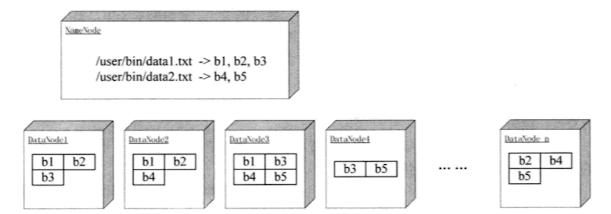

# 详解 HDFS

## 1. 为什么要有 HDFS ？

当数据集的大小超过一台独立的物理计算机的存储能力时，就需要对它进行分区并存储到多台单独的计算机上。管理网络中跨多台计算机存储的文件系统称为分布式文件系统（distributed filesystem）。该系统架构于网络之上，势必会引入网络编程的复杂性，因此分布式文件系统比普通的磁盘文件系统更为复杂，例如，使文件能够容忍节点故障且不丢失任何数据，就是一个极大的挑战。

Hadoop 自带一个称为 HDFS 的分布式文件系统，即 Hadoop Distributed Filesystem。

> 这也就引出了 HDFS 如下的设计目标。

<br>

## 2. 设计目标

- **支持超大文件**。超大文件在这里指的是几百 MB、几百 GB 甚至几 TB 的文件，一般来说，一个 Hadoop 文件系统会存储 TB、PB 级别的数据。

- **检测和快速应对硬件故障**。在大量通用硬件平台上构建集群时，故障，特别是硬件故障是常见的问题。一般的 HDFS 系统是由几百台甚至上千台存储着文件的服务器组成，因此，故障检测和自动恢复是 HDFS 所需要的。

- **流式数据访问**。HDFS 处理的数据规模都很大，应用一次需要访问大量的数据。同时，这些应用一般是批量处理，而不是用户交互式的处理。HDFS 使应用程序能够以流的形式访问数据集，注重的是数据的吞吐量，而不是数据的访问速度。（所以大数据叫大数据，而不是快数据？！）

- **简化的一致性模型**。大部分的 HDFS 程序操作文件时需要一次写入，多次读取。在 HDFS 中，一个文件一旦经过创建、写入、关闭后，一般就不需要修改了。这样简单的一致性模型，有利于提供高吞吐量的数据访问模型。
（如果就是要修改怎么办？删了重新写！）

**正是由于以上的设计目标，HDFS 并不适合如下应用。**

- **低延迟数据访问**。低延迟数据，如和用户进行交互的应用，需要数据在毫秒或秒的范围内得到响应。由于 Hadoop 针对高数据吞吐量做了优化，而牺牲了获取数据的延迟，对于低延迟的访问，可以考虑使用 HBase 或 Cassandra。

- **大量的小文件**。HDFS 支持超大文件，是通过将数据分布在数据节点（DataNode），并将文件的元数据保存在元数据节点（NameNode）上。NameNode 的内存大小，决定了 HDFS 可存储的文件数量，虽然现在的系统内存都比较大，但大量的小文件还是会影响 NameNode 的性能。
（什么是元数据？假设数据是我们的房子，那么元数据就是房子的地址（门牌号））

- **多用户写入文件、修改文件**。HDFS 中的文件只能有一个写入者，而且写操作总是在文件末。它不支持多个写入者，也不支持在数据写入后，在文件的任意位置进行修改。

In a word，HDFS 是为以流式数据访问模式存储超大文件而设计的文件系统，并在普通商用硬件集群上运行。

<br>

## 3. 核心组件解释

### 3.1 HDFS 体系结构图


### 3.1 Blocks

数据的存取都是以 Block 为单位，HDFS 默认的 Block 大小为 128 M，HDFS 的文件被拆分成 block-sized 的 chunk，chunk 作为独立单元存储。比 Block 小的文件不会占用整个 Block，只会占据实际大小。例如， 如果一个文件大小为 1M，则在 HDFS 中只会占用 1M 的空间，而不是 128M。

- HDFS 使用数据块带来了很多的好处

1. HDFS 可以保存比存储节点单一磁盘大的文件：因为文件块可以保存在集群的任何一个磁盘上。

2. 简化了存储子系统：将管理 “块” 和管理 “文件” 的功能区分开，简化了存储管理，也消除了分布式管理文件元数据的复杂性。

3. 方便容错，有利于数据的复制：如果一个数据块副本丢失或者损坏了，系统会在其他地方读取副本，这个过程对用户来说是透明的，它实现了分布式系统中的位置透明性和故障透明性。
<br>
**为什么在 HDFS 中要使用这么大的数据块呢？**
<br>
原因和在磁盘上使用大磁盘的原理是一样的。在普通文件系统中使用较大的磁盘块，可以减少管理数据块需要的开销，如在 Linux 中可以减少保存在 i-node 中磁盘地址表中的信息链的长度；同时，在对文件进行读写时，可以减少寻址的开销，即磁盘定位数据块的次数。
<br>
HDFS 中使用大数据块，可以减少 NameNode 节点上管理文件和数据块关系的开销，同时对数据块进行读写时，可以有效地减少建立网络连接需要的成本。


### 3.2 NameNode & Secondary NameNode

#### 3.2.1 NameNode

NameNode 是 HDFS 主从结构中主节点上运行的主要进程，它指导主从结构中的从节点，DataNode 执行底层的 I/O 任务。

NameNode 维护着整个文件系统的文件目录树，文件 / 目录的元信息和文件的数据块索引，即每个文件对应的数据块列表。这些信息以两种形式存储在本地文件系统中：一种是命名空间镜像（File System Image， FSImage，也称文件系统镜像），另一种是命名空间镜像的编辑日志（Edit Log）。

命名空间镜像保存着某一特定时刻 HDFS 的目录树、元信息和数据块索引等信息，后续对这些信息的改动，则保存在编辑日志中，它们一起提供了一个完整的名字节点第一关系。

#### 3.2.2 Secondary NameNode

第二名字节点，不是 NameNode 的备份节点，而是一个“工具人”，是用于定期合并命名空间镜像和镜像编辑日志的辅助守护进程。和 NameNode 一样，每个集群都有一个第二名字节点，在大规模部署的条件下，一般第二名字节点也会独自占用一台服务器。

**具体做什么？**

区别于 NameNode，SNN 不接收或记录 HDFS 的任何实时变化，而只是根据集群配置的时间间隔，不停地获取 HDFS 某一个时间点的命名空间镜像和镜像的编辑日志的辅助守护进程，合并得到一个新的命名空间镜像，该新镜像会上传到 NN 上，替换原有的命名空间镜像，并情况上述日志。

### 3.3 DataNode 

- 存储数据

在数据节点上 HDFS 文件块(也就是 Block)以 Linux 文件系统上的普通文件进行保存。

- 读取数据

客户端想要对文件内容进行操作时，先由名字节点告知客户端每个数据块驻留在哪个数据节点，然后客户端直接与数据节点守护进程进行通信，处理数据块对应的本地文件。

- 保障数据的冗余性

数据节点会和其他数据节点进行通信，复制数据块，以保证数据的冗余性。数据节点作为从节点，会不断的向名字节点报告。初始化时，每个数据节点将当前存储的数据块告知名字节点。后续数据节点工作过程中，数据节点仍会不断的更新名字节点，为之提供本地修改的相关信息，并接受来自名字节点的指令，创建、移动或者删除本地磁盘上的数据块。



### 3.4 Client

客户端是用户和 HDFS 进行交互的手段，HDFS 提供了各种各样的客户端，包括命令行接口、JavaAPI、C 语言库、用户空间文件系统等。

```Bash
# 创建文件夹
hadoop fs -mkdir testDIR
```

