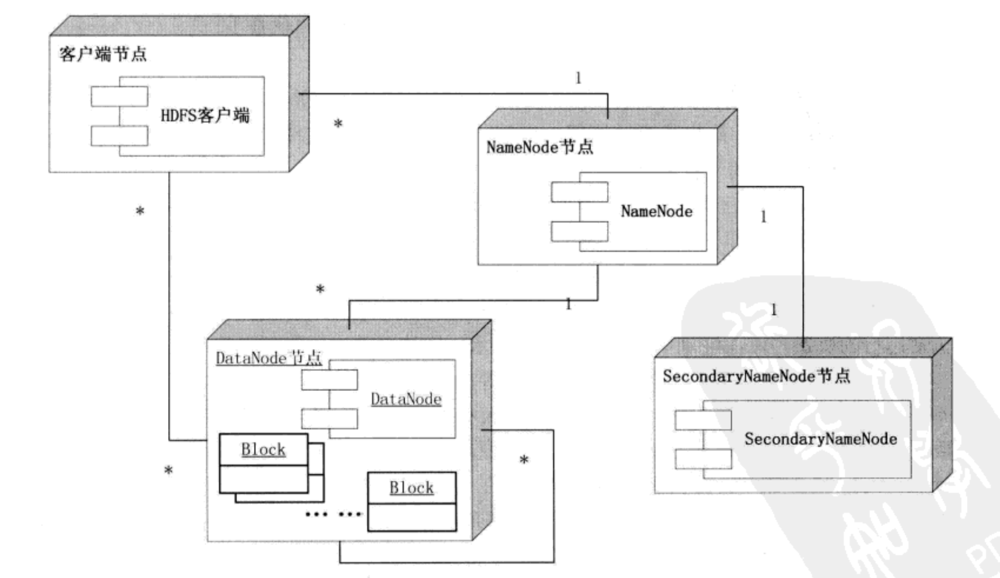

# 详解 HDFS

## 1. 为什么要有 HDFS ？

当数据集的大小超过一台独立的物理计算机的存储能力时，就需要对它进行分区并存储到多台单独的计算机上。管理网络中跨多台计算机存储的文件系统称为分布式文件系统（distributed filesystem）。该系统架构于网络之上，势必会引入网络编程的复杂性，因此分布式文件系统比普通的磁盘文件系统更为复杂，例如，使文件能够容忍节点故障且不丢失任何数据，就是一个极大的挑战。

Hadoop 自带一个称为 HDFS 的分布式文件系统，即 Hadoop Distributed Filesystem。

> 这也就引出了 HDFS 如下的设计目标。

 

## 2. 设计目标

- **支持超大文件**。超大文件在这里指的是几百 MB、几百 GB 甚至几 TB 的文件，一般来说，一个 Hadoop 文件系统会存储 TB、PB 级别的数据。

- **检测和快速应对硬件故障**。在大量通用硬件平台上构建集群时，故障，特别是硬件故障是常见的问题。一般的 HDFS 系统是由几百台甚至上千台存储着文件的服务器组成，因此，故障检测和自动恢复是 HDFS 所需要的。

- **流式数据访问**。HDFS 处理的数据规模都很大，应用一次需要访问大量的数据。同时，这些应用一般是批量处理，而不是用户交互式的处理。HDFS 使应用程序能够以流的形式访问数据集，注重的是数据的吞吐量，而不是数据的访问速度。（所以大数据叫大数据，而不是快数据？！）

- **简化的一致性模型**。大部分的 HDFS 程序操作文件时需要一次写入，多次读取。在 HDFS 中，一个文件一旦经过创建、写入、关闭后，一般就不需要修改了。这样简单的一致性模型，有利于提供高吞吐量的数据访问模型。
（如果就是要修改怎么办？删了重新写！）

**正是由于以上的设计目标，HDFS 并不适合如下应用。**

- **低延迟数据访问**。低延迟数据，如和用户进行交互的应用，需要数据在毫秒或秒的范围内得到响应。由于 Hadoop 针对高数据吞吐量做了优化，而牺牲了获取数据的延迟，对于低延迟的访问，可以考虑使用 HBase 或 Cassandra。

- **大量的小文件**。HDFS 支持超大文件，是通过将数据分布在数据节点（DataNode），并将文件的元数据保存在元数据节点（Namenode）上。Namenode 的内存大小，决定了 HDFS 可存储的文件数量，虽然现在的系统内存都比较大，但大量的小文件还是会影响 Namenode 的性能。
（什么是元数据？假设数据是我们的房子，那么元数据就是房子的地址（门牌号））

- **多用户写入文件、修改文件**。HDFS 中的文件只能有一个写入者，而且写操作总是在文件末。它不支持多个写入者，也不支持在数据写入后，在文件的任意位置进行修改。

In a word，HDFS 是为以流式数据访问模式存储超大文件而设计的文件系统，并在普通商用硬件集群上运行。

 

## 3. 核心组件解释

### 3.1 HDFS 体系结构图

### 3.1 Blocks

数据的存取都是以 Block 为单位，HDFS 默认的 Block 大小为 128 M，HDFS 的文件被拆分成 block-sized 的 chunk，chunk 作为独立单元存储。比 Block 小的文件不会占用整个 Block，只会占据实际大小。例如， 如果一个文件大小为 1M，则在 HDFS 中只会占用 1M 的空间，而不是 128M。

- HDFS 的 Block 为什么这么大？

最小化查找数据的时间，控制定位文件与传输时间所用的比例。

### 3.2 Namenode & Datanode

整个 HDFS 集群是由 Namenode 和 Datanode 构成的 master-worker 模式。其中，Namenode 负责构建命名空间，管理文件的元数据等，而 Datanode 负责实际存储数据的读写工作。

#### 3.2.1 Namenode

