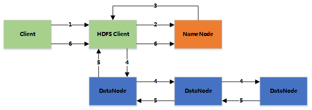

# HDFS-写文件

1. 客户端将文件写入本地磁盘的 HDFS Client 文件中

2. 当临时文件大小达到一个 block 大小时，HDFS client 通知 NameNode，申请写入文件

3. NameNode 在 HDFS 的文件系统中创建一个文件，并把该 block id 和要写入的 DataNode 的列表返回给客户端

4. 客户端收到这些信息后，将临时文件写入 DataNodes
    
    - 客户端将文件内容写入第一个 DataNode（一般以 4kb 为单位进行传输）
    - 第一个 DataNode 接收后，将数据写入本地磁盘，同时也传输给第二个 DataNode
    - 依此类推到最后一个 DataNode，数据在 DataNode 之间是通过 pipeline 的方式进行复制的
    - 后面的 DataNode 接收完数据后，都会发送一个确认给前一个 DataNode，最终第一个 DataNode 返回确认给客户端
    - 当客户端接收到整个 block 的确认后，会向 NameNode 发送一个最终的确认信息
    - 如果写入某个 DataNode 失败，数据会继续写入其他的 DataNode。然后 NameNode 会找另外一个好的DataNode 继续复制，以保证冗余性
    - 每个 block 都会有一个校验码，并存放到独立的文件中，以便读的时候来验证其完整性

5. 文件写完后（客户端关闭），NameNode 提交文件（这时文件才可见，如果提交前，NameNode 垮掉，那文件也就丢失了。fsync：只保证数据的信息写到 NameNode 上，但并不保证数据已经被写到 DataNode 中）

 

### Rack aware (机架感知)

 
通过配置文件指定机架名和 DNS 的对应关系，假设复制参数是 3，在写入文件时，会在本地的机架保存一份数据，然后在另外一个机架内保存两份数据（同机架内的传输速度快，从而提高性能），整个 HDFS 的集群，最好是负载平衡的，这样才能尽量利用集群的优势。